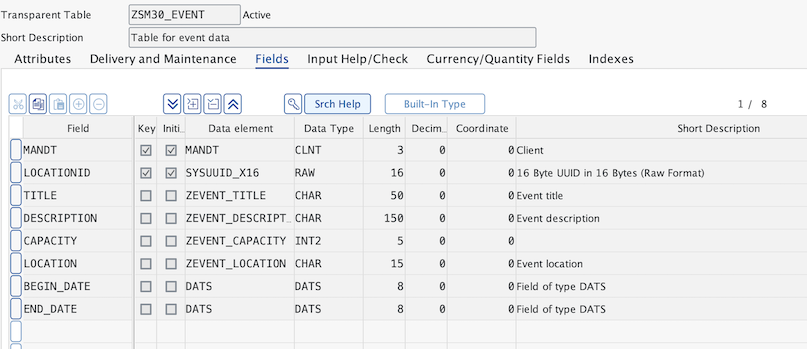
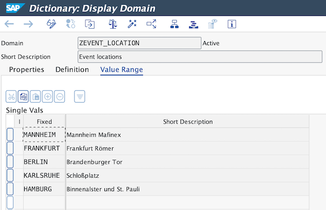
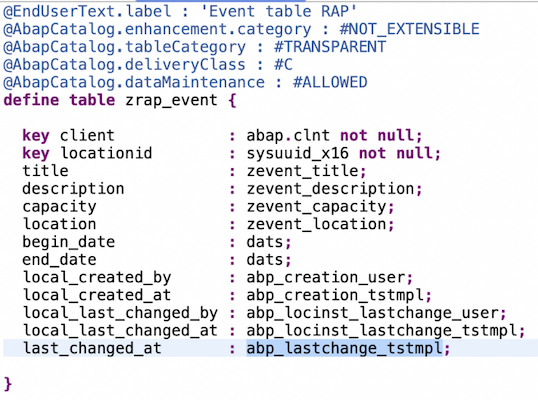

# Table maintenance in S/4HANA on premise or private cloud

This repository serves as an example for custom table maintenance in S/4HANA. It is the code of the corresponding blog post [Table maintenance in S/4HANA on premise or private cloud](https://www.itsfullofstars.de/2024/10/table-maintenance-in-s-4hana-on-premise-or-private-cloud/). Custom table maintenance is done using the classic SAP ABAP table maintenance generator and SM30, and the S/4HANA approach using RAP: Business Configuration Maintenance Object and App.

The coding follows the blog post. A simple sample database table for storing event data is used: [ZSM30_EVENT](src/sm30/zsm30_event.tabl.xml).

The table field location is a reference to the domain [ZEVENT_LOCATION](src/zevent_location.doma.xml) where some fixed values are configured.

## Sample scenario walkthrough

The sample uses the package $EVENT and two sub packages $SM30 and $RAP. Coding for the classic SM30 table maintenance is in package $SM30. Coding for the Business Configuration Maintenance is in package $RAP. Starting point is a simple event table for which a consultant will be enabled to enter data. Once per SM30, once per the Fiori app Business Configuration Maintenance App.

### Table

The starting point of the blog post is the table and base types. There are in tag [1-sm30-table](https://github.com/tobiashofmann/table-maintenance-sm30-bcmo/releases/tag/1-sm30-table).

### Table Maintenance Dialog

The table maintenance dialog for the table ZSM30_EVENT is created in tag [2-table-maintenance-view](https://github.com/tobiashofmann/table-maintenance-sm30-bcmo/releases/tag/2-table-maintenance-view). The function group ZSM30_FUGR_LOC is created and the table maintenance can be started in SM30.

### RAP sample database table

The RAP object for the table is created. A new table is created to make use of RAP reuse data elements.

 

The status of the project with the new event table is available in tag [3-rap-table-event](https://github.com/tobiashofmann/table-maintenance-sm30-bcmo/releases/tag/3-rap-table-event).

### Business Configuration Maintenance Object

The ADT wizard is used to create the Business Configuration Maintenance Object based on the table ZRAP_EVENT. The created RAP objects can be found in tag [4-bcmo-adt-wizard](https://github.com/tobiashofmann/table-maintenance-sm30-bcmo/releases/tag/4-bcmo-adt-wizard).

### Business Configuration Maintenance App

The app is not part of this repository. Refer the blog post the see how to use the app to maintain data for table ZRAP_EVENT using the previously generated Business Configuration Maintenance Object.

The Excel file with the sample data used in the blog post for the copy&paste demo is also in this repository: [EventTableRaps.xlsx](https://github.com/tobiashofmann/table-maintenance-sm30-bcmo/raw/refs/heads/main/EventTableRaps.xlsx).